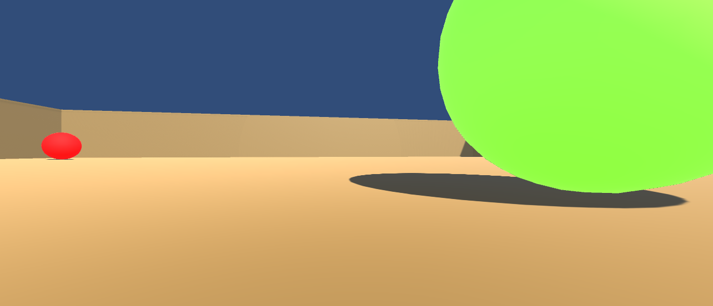
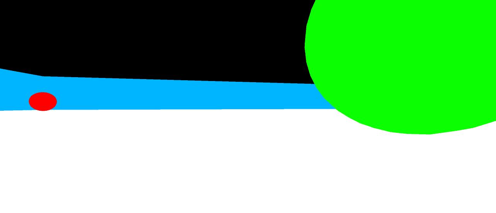
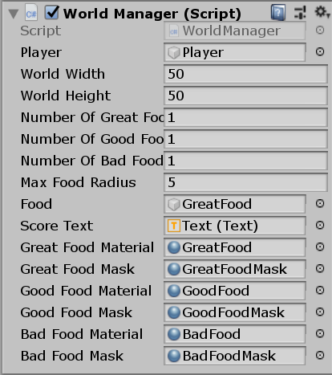
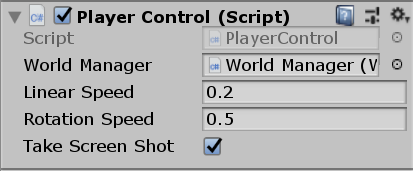

# Animal-AI Reverse-Engineering

This is an Unity project that reverse engineer the basic mechanisms of Animal-AI to fascilitate better training. The core features of this project are:
* ACchieves the basic functionalities of the Animal-AI environment, including
    * Randomized initialization of different food (great food: yellow, good food: green, bad food: red)
    * Restart episode when the player eats a food.
    * Records score for each episode. `W S A D` Control of player movement.
* Displays the masks of the objects in the player's view.
* Simulates the depth-sensing camera in the player's view.
* Records each frame (RBG, mask, depth) in the `Asssets/StreamingAssets` folder.
* Training using Unity ML agent.

RGB Screenshot:

Mask Screenshot:

Depth Screenshot:

## Installation

### Prerequisites

1. [Unity Editor 2019.2.1f1](https://unity3d.com/get-unity/download) - The main game engine
2. Windows 10 Pro
3. Microsoft Visual Studio 2019 Version 16.2.3 - Go to `Help -> About Microsoft Visual Studio`, and check that the following products are installed:
    * C# tools
    * Visual Studio Tools for Unity

### Install From Unity Package

1. Create a new project for Unity 2019.2.1f1.
2. Download and import (Assets > Import Package > Custom Package) [the Animal-AI package](https://drive.google.com/file/d/1QaZW4PZxSU1aM6dKWdutAEgG-8Xns5lx/view?usp=sharing).
3. Setup the World Manager and the Player:
    * Set the linear and rotational speed for the player.
    * Check the toggle for `Take Screen Shot`.

Settings for the world manager and the player:

